<div align="center">

  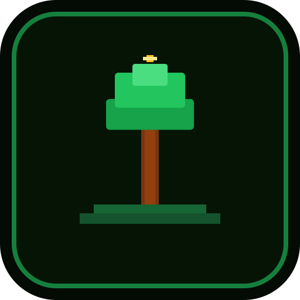

  # SAPLING GROOVE

  **A mindful, cyber-botanical focus environment and digital productivity sanctuary.**

  *Transform your daily attention into living, procedural botanical monuments.*

  <br />

  [](https://sapling-groove.vercel.app)
  [](docs/architecture/system-overview.md)
  [](LICENSE)

  <br />

  

</div>

---

> **Public Showcase Notice**: This repository is the public project showcase, architectural case study, and technical portfolio for Sapling Groove. The complete production implementation is maintained privately. For technical review access, see [Technical Review](#-technical-review).

---

## ✦ Table of Contents
- [What is Sapling Groove?](#-what-is-sapling-groove)
- [The Idea](#-the-idea)
- [Why I Built It](#-why-i-built-it)
- [From Prototype to Ecosystem](#-from-prototype-to-ecosystem)
- [The Product Experience](#-the-product-experience)
- [Growth & Vitality Model](#-growth--vitality-model)
- [Design Language: Cyber-Organic Solarpunk](#-design-language-cyber-organic-solarpunk)
- [Engineering Architecture](#-engineering-architecture)
- [Technical Challenges & Solutions](#-technical-challenges--solutions)
- [Visual Showcase](#-visual-showcase)
- [What I Learned](#-what-i-learned)
- [Live Demo](#-live-demo)
- [Technical Review](#-technical-review)
- [License](#-license)

---

## ✦ What is Sapling Groove?

**Sapling Groove** is a web-based productivity sanctuary engineered for deep work, creative writing, research, and coding rituals. 

Instead of treating focus like a corporate ticketing queue with red notification badges and urgent streak counters, Sapling Groove grounds human attention in **procedural botanical growth**. As you dedicate uninterrupted hours to your real-world intentions, your personal digital grove germinates from delicate sprouts into towering, permanent mature canopies.

---

## ✦ The Idea

> *"Your attention is a seed. What you tend grows; what you ignore withers gently without judgment."*

Modern productivity software often treats human beings like industrial assembly lines. We are told to optimize every fifteen-minute block, keep arbitrary streak counters alive at all costs, and feel guilty whenever natural life disruptions occur.

Sapling Groove was built around an alternative realization:
1. **Focus is seasonal**: Human creativity and energy ebb and flow naturally.
2. **Work should leave a living trace**: When you spend two hours in deep problem-solving, seeing a tangible, procedural living monument creates deep emotional closure.
3. **Non-punitive discipline**: Missed days should never erase accrued hard work. A tree bends in winter; it does not reset to zero.

---

## ✦ Why I Built It

As a software engineer and student, I found commercial focus apps distracting:
- Traditional timers felt sterile, cold, and transactional.
- Gamified apps felt childish, bombarding the user with confetti, intrusive sound effects, and paywalls.
- Most apps required large bundled audio files and forced account creation before allowing a single session.

I wanted an environment that felt like an **atmospheric research observatory stationed in a tranquil biosphere**—a place with zero digital noise, immediate offline access, procedural generative soundscapes, and authentic artistic soul.

---

## ✦ From Prototype to Ecosystem

Sapling Groove did not emerge in a single burst of inspiration; it matured through intentional architectural iteration:

```text
┌─────────────────────────────────┐
│     STAGE 1: THE PROTOTYPE      │  • Simple 25m countdown timer
│     "A timer with a canvas"     │  • 2D fractal tree drawn only at session completion
└────────────────┬────────────────┘  • Isolated single trees; no persistent habitat
                 │
                 ▼
┌─────────────────────────────────┐
│     STAGE 2: THE EXPANSION      │  • Added 3D rendering and ambient sound experiments
│  "Feature growth & friction"    │  • Friction: Multiple WebGL contexts overloaded mobile GPUs
└────────────────┬────────────────┘  • AI chat was passive and unanchored from user grove state
                 │
                 ▼
┌─────────────────────────────────┐
│     STAGE 3: THE SANCTUARY      │  • Unified Cyber-Organic Design Language (70/30 solarpunk)
│ "Cohesive Mindful Ecosystem"    │  • Tri-modal rituals (Chronos, Groove, Pomodoro)
└─────────────────────────────────┘  • Focus Observatory: continuous-surface heatmaps & analytics
                                     • Ani: Context-aware AI Co-Pilot with executable action blocks
                                     • 100% zero-sample Web Audio API procedural synthesis
```

👉 *Read the full architectural narrative: [Product Evolution Case Study](docs/case-study/product-evolution.md)*

---

## ✦ The Product Experience

Sapling Groove is composed of cohesive instruments designed to harmonize attention:

| Instrument | Visual | Purpose & Experience |
| :--- | :---: | :--- |
| **The Grove** | 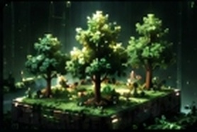 | **The living sanctuary.** Your 3D procedural botanical world where your intentions thrive, branch, and form an Eternal Canopy. |
| **Chronos Ritual** |  | **Structured focus.** Circular countdown rituals (15m, 25m, 45m, 60m) accompanied by procedural harmonic resonance. |
| **Groove Flow** | 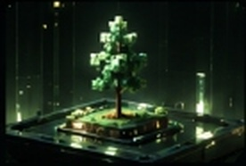 | **Open-ended flow state.** Enter deep creative work without arbitrary time limits; your cultivar expands continuously until you conclude. |
| **Pomo Cycles** |  | **Agile sprints.** Classic interval focus with clean tactile HUD controls and automated rest intervals. |
| **Focus Observatory** |  | **Deterministic analytics.** Continuous-surface dashboard tracking focus velocity, 30-day rhythm curves, hourly attention fields, and species diversity. |
| **Ani AI Companion** |  | **The Grove Steward.** A grounded, calm AI focus co-pilot that synthesizes intentions and emits executable action blocks. |

---

## ✦ Growth & Vitality Model

Traditional apps punish missed days by resetting streak counters to zero. Sapling Groove introduces a **dual-axis biological growth model**:

```text
┌────────────────────────────────────────────────────────────────────────┐
│                        THE DUAL-AXIS LIFECYCLE                         │
├───────────────────────────────────┬────────────────────────────────────┤
│         ACCUMULATED WORK          │          CURRENT VITALITY          │
│      (Permanent / Unshakable)     │       (Fluid / Responsive)         │
├───────────────────────────────────┼────────────────────────────────────┤
│ • Every focused minute is banked  │ • Reflects recent practice rhythm  │
│ • Trees never shrink in stature   │ • Thriving under regular tending   │
│ • Hard milestones are forever     │ • Enters dormancy/wilt if neglected│
│ • Never erased by missed days     │ • Rapidly recovers upon return     │
└───────────────────────────────────┴────────────────────────────────────┘
```

- **Non-Punitive Wilting**: If you step away for a week, your tree does not disappear. Its foliage gently shifts to a dormant amber tone and branch health rests at a protected floor (15%).
- **Accelerated Recovery**: Returning to practice immediately halts wilting and rapidly restores chlorophyll vitality.
- **Eternal Canopy**: Once an intention's target hours are fulfilled, the tree enters the Permanent Canopy—forever thriving and immune to drought.

👉 *Read the complete technical breakdown: [Botanical Growth Model](docs/architecture/botanical-growth-model.md)*

---

## ✦ Design Language: Cyber-Organic Solarpunk

The aesthetic formula balances **70% botanical calm and 30% retro-futuristic technology**:

- **Substrate**: Deep chlorophyll and dark moss foundations (`#040a04` to `#0a160a`) to protect eyes during multi-hour night sessions.
- **Bioluminescent Spores**: Subtle phosphor green (`#22c55e`) and amber glows that pulse at calm breathing cadences.
- **Tactile Physicality**: Buttons compress on press (`scale(0.97)`) with authentic mechanical resistance.
- **Zero-Jitter Numerics**: All timers and analytics counters strictly apply `tabular-nums` (`font-variant-numeric: tabular-nums`) to prevent horizontal layout shifting.

👉 *Read the full design principles: [Design Philosophy Case Study](docs/case-study/design-philosophy.md)*

---

## ✦ Engineering Architecture

```text
┌────────────────────────────────────────────────────────────────────────┐
│                       CLIENT RUNTIME (BROWSER)                         │
│                                                                        │
│  ┌───────────────────┐  ┌────────────────────┐  ┌───────────────────┐  │
│  │   UI & Controls   │  │   WebGL Engine     │  │ Web Audio Engine  │  │
│  │    (React 19)     │  │ (Three.js / 60fps) │  │  (Zero-Sample)    │  │
│  └─────────┬─────────┘  └──────────┬─────────┘  └─────────┬─────────┘  │
│            │                       │                      │            │
│  ┌─────────┴───────────────────────┴──────────────────────┴─────────┐  │
│  │                Core State Machine & Storage Layer                │  │
│  │              (Defensive Schema Validation / Local)               │  │
│  └─────────────────────────────────┬────────────────────────────────┘  │
└────────────────────────────────────┼───────────────────────────────────┘
                                     │
                     Cloud Sync & Edge Boundary
                                     │
           ┌─────────────────────────┴─────────────────────────┐
           │                                                   │
           ▼                                                   ▼
┌─────────────────────┐                             ┌────────────────────┐
│  Firebase Services  │                             │ Vercel Serverless  │
│ ─────────────────── │                             │ ────────────────── │
│ • Firebase Auth     │                             │ • AI Companion API │
│ • Cloud Firestore   │                             │ • Field Reports    │
└─────────────────────┘                             └────────────────────┘
```

- **Frontend Core**: React 19, TypeScript, Tailwind CSS v4, Vanilla CSS
- **3D Graphics & Shaders**: Three.js, procedural voxel generation, WebGL lifecycle management
- **Audio Architecture**: Native Web Audio API zero-sample procedural synthesis
- **Persistence & Sync**: Local-first offline storage + Cloud Firestore
- **Authentication**: Firebase Authentication (Anonymous guest linking, Google, GitHub)
- **Edge Functions**: Vercel Serverless Functions with rate limiting and payload validation

👉 *Read the full architectural specification: [System Architecture Overview](docs/architecture/system-overview.md)*

---

## ✦ Technical Challenges & Solutions

### 1. WebGL Context Governance & 8ms Frame Budgets
*Problem*: Multiple simultaneous WebGL canvas instances created excessive active contexts, triggering context loss and thermal throttling on mobile devices.  
*Solution*: Built an on-demand lifecycle manager using `IntersectionObserver` to freeze offscreen canvases, unified rendering around a single hero specimen, and enforced zero heap allocations inside the 60fps render loop.  
👉 *[Read WebGL Performance Case Study](docs/architecture/webgl-performance.md)*

### 2. Mobile Ergonomics & Viewport Dynamics
*Problem*: Mobile browser address bars caused bottom navigation clipping and vertical layout jumps with standard `100vh`.  
*Solution*: Implemented a modern `100svh` dynamic viewport architecture paired with CSS hardware safe-area tokens (`--sat`, `--sab`, `--bottom-nav-height`) ensuring rock-solid thumb ergonomics.  
👉 *[Read Mobile Experience Case Study](docs/case-study/mobile-experience.md)*

### 3. Zero-Sample Procedural Soundscapes
*Problem*: Bundling multi-megabyte audio recordings increased bundle sizes, caused audible loop seams, and failed during offline network drops.  
*Solution*: Synthesized soundscapes entirely client-side using mathematical Web Audio API oscillator/noise graphs (432Hz sine drones, filtered rain noise, Tibetan harmonic singing bowls) with explicit `onended` node disposal to eliminate memory leaks.  
👉 *[Read Audio System Architecture](docs/architecture/audio-system.md)*

### 4. Grounded AI with Executable Action Blocks
*Problem*: Generic AI chat widgets feel disconnected from application state and encourage passive conversation rather than active focus.  
*Solution*: Engineered Ani as a context-aware Grove steward emitting structured `<ani_action>` blocks that allow users to plant proposed intentions, start rituals, or break down goals with a single click directly inside the chat stream.  
👉 *[Read Ani Co-Pilot Case Study](docs/case-study/ani-focus-architect.md)*

---

## ✦ Visual Showcase

These captures show the application as it actually runs in the browser; the static artwork below is supplementary project visual material.

### The Living World
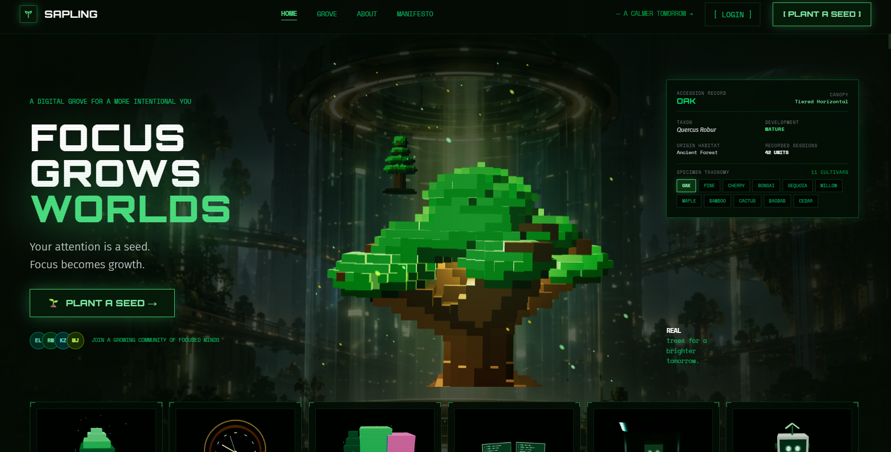

### The Botanical Grove
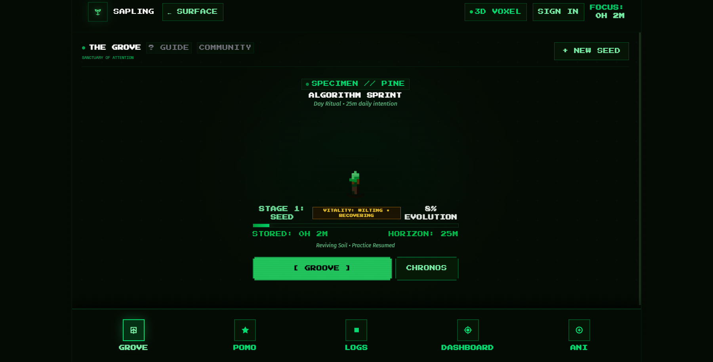

### Focus Rituals
<div align="center">
  <table border="0">
    <tr>
      <td width="50%" align="center">
        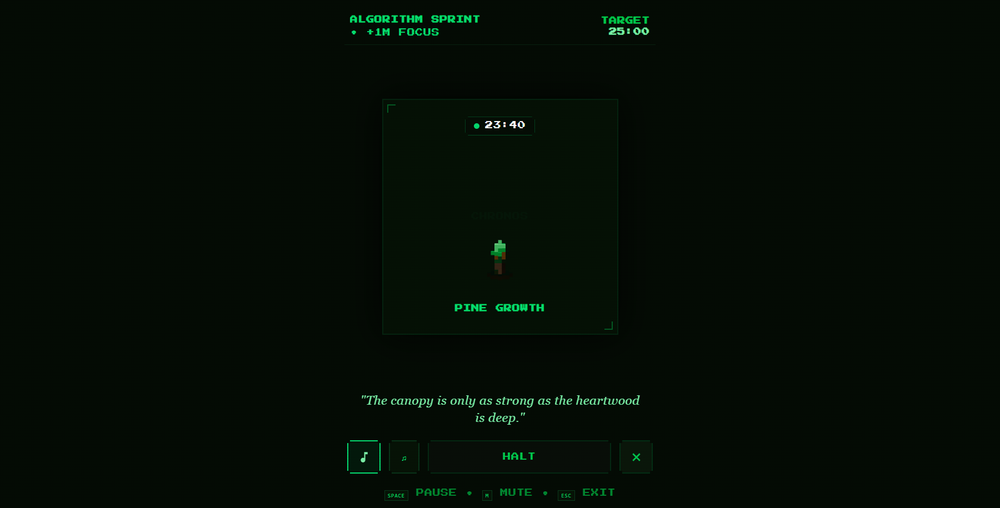
        <br /><em>Chronos: Structured Circular Countdown Ritual</em>
      </td>
      <td width="50%" align="center">
        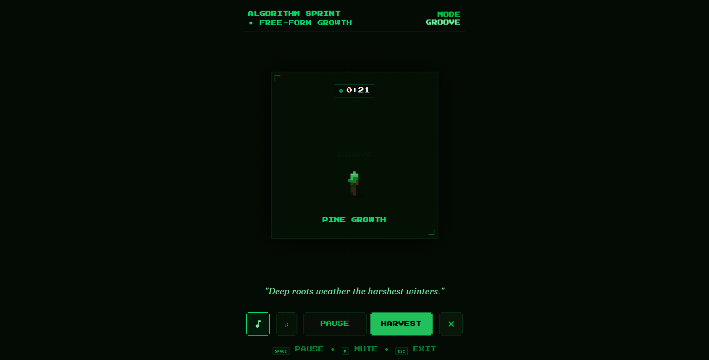
        <br /><em>Groove: Open-Ended Flow State Practice</em>
      </td>
    </tr>
  </table>
</div>

### Focus Observatory
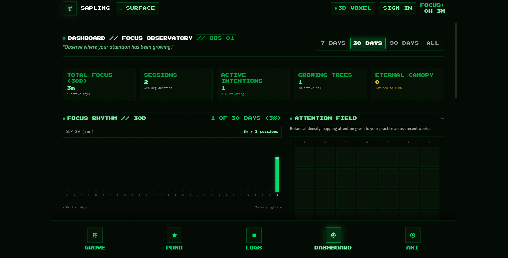

### Ani
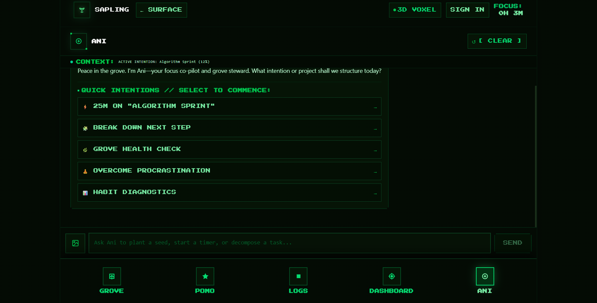

### Mobile Experience
<div align="center">
  <table border="0">
    <tr>
      <td width="50%" align="center">
        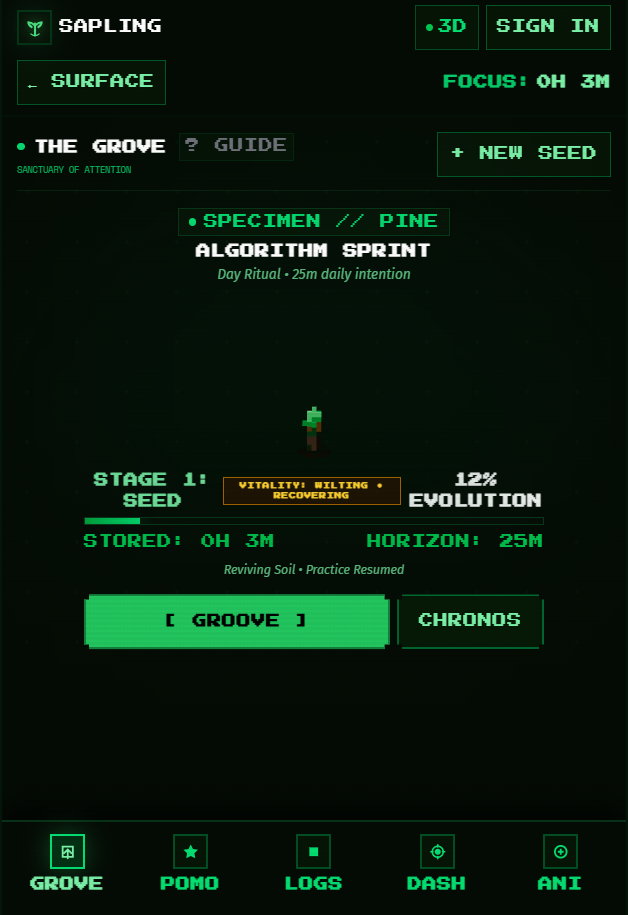
        <br /><em>Mobile Sanctuary HUD (100svh Viewport)</em>
      </td>
      <td width="50%" align="center">
        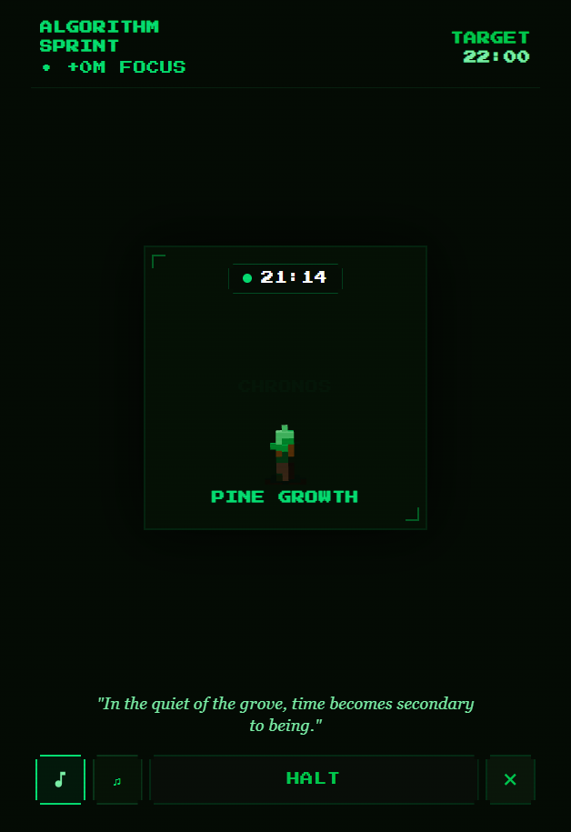
        <br /><em>Mobile Ritual Timer & Safe-Area Clearance</em>
      </td>
    </tr>
  </table>
</div>

### Supporting Visuals
<div align="center">
  <table border="0">
    <tr>
      <td width="33%" align="center"><br /><em>The Grove</em></td>
      <td width="33%" align="center"><br /><em>Chronos</em></td>
      <td width="33%" align="center"><br /><em>Groove</em></td>
    </tr>
    <tr>
      <td width="33%" align="center"><br /><em>Pomodoro</em></td>
      <td width="33%" align="center"><br /><em>Observatory</em></td>
      <td width="33%" align="center"><br /><em>Ani</em></td>
    </tr>
  </table>
</div>

---

## ✦ What I Learned

1. **Architecture is Ergonomics**: Beautiful code is meaningless if the application stutters on a phone or drains the battery. Profiling frame times and memory allocations is as fundamental to user experience as choosing color palettes.
2. **Local-First Respects Users**: By prioritizing local browser soil first and making cloud authentication optional, users feel ownership of their space. Trust is earned through respect for privacy.
3. **Restraint Over Feature Sprawl**: The temptation in productivity software is to continually add tags, sub-tasks, and project boards. Resisting this sprawl to protect atmospheric stillness was the most difficult—and rewarding—design decision.

---

## ✦ Live Demo

Experience the live application in your browser:

🔗 **[https://sapling-groove.vercel.app](https://sapling-groove.vercel.app)**

*No account required. Instant guest access in local browser storage.*

---

## ✦ Technical Review

The complete production source code, automated test suites, and continuous deployment workflows are maintained in a separate private repository.

If you are a recruiter, engineering leader, or technical collaborator wishing to inspect the production implementation, architecture verification reports, or test suites, repository access can be provided upon request:

- **GitHub Profile**: [@aniruddhangujar](https://github.com/aniruddhangujar)
- **Contact / Requests**: Open an issue or reach out via GitHub profile channels.

---

## ✦ License

Copyright © 2026 Aniruddha Gujar. All rights reserved.

This repository is maintained for portfolio demonstration, educational inspection, and architectural evaluation under the [Proprietary Portfolio License](LICENSE).
